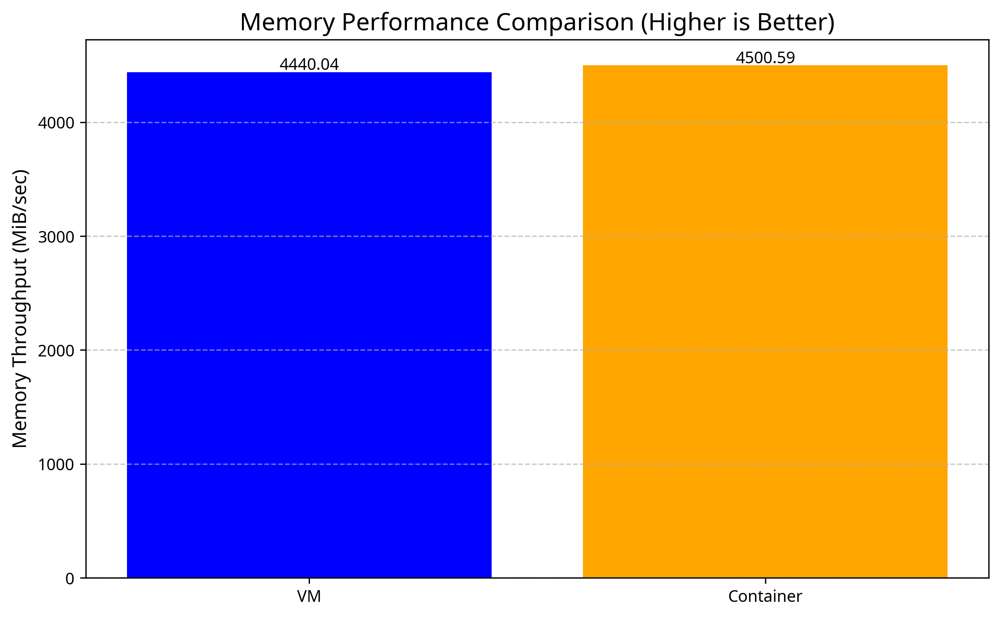
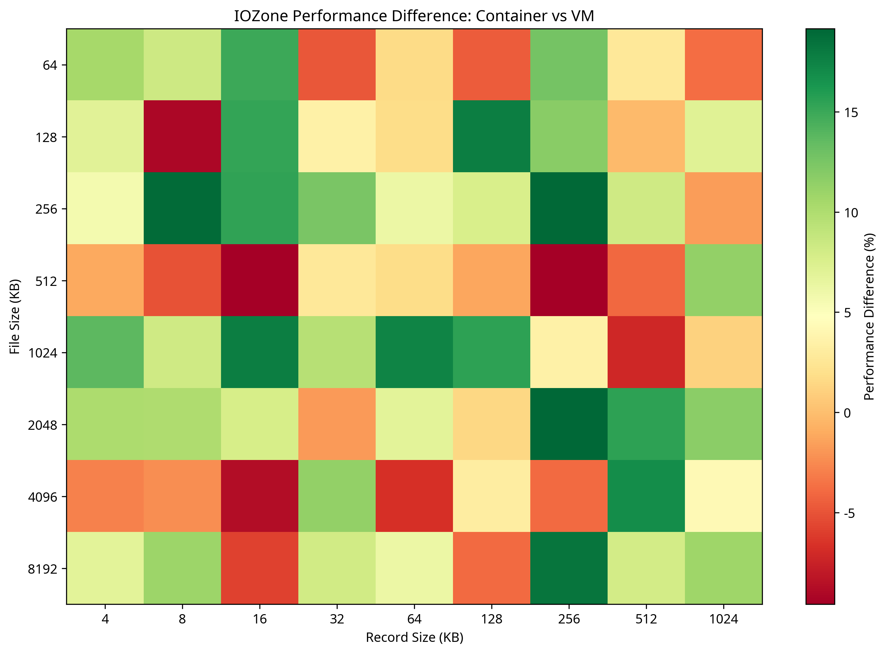
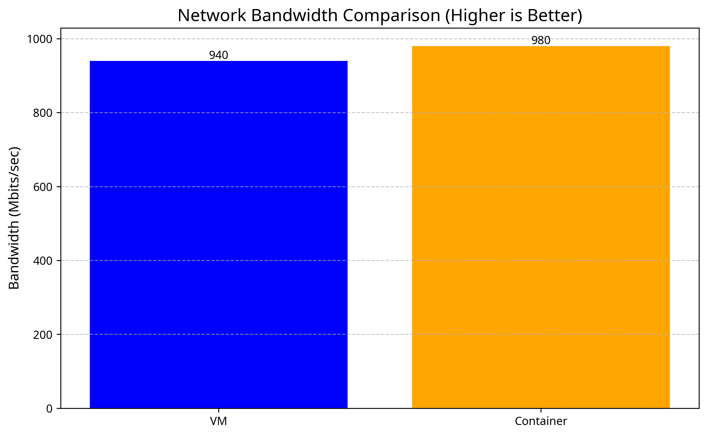
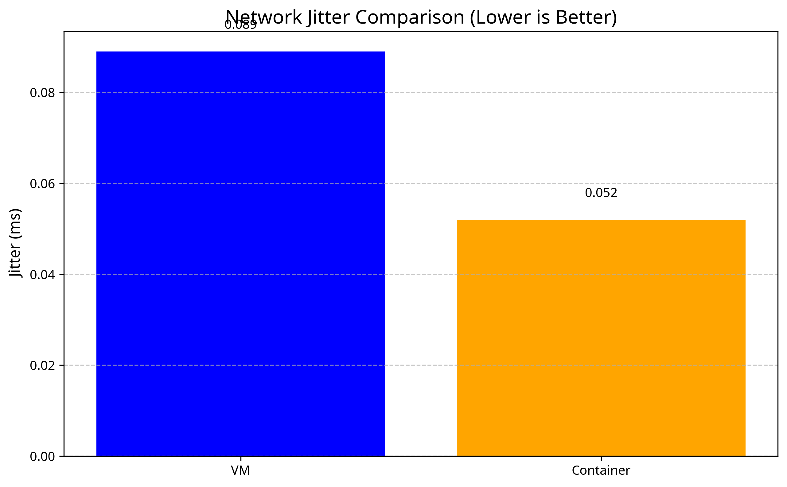

# Cloud Computing Performance Testing Report

## Objective
This report evaluates and compares the performance of virtual machines (VMs) and containers with identical resource constraints. The goal is to understand the performance differences between these virtualization technologies across various metrics including CPU, memory, disk I/O, and network performance.

## General Instructions
- Linux distribution: Ubuntu 22.04
- Virtualization: VirtualBox for VMs, Docker for containers
- Resource allocation: 2 CPUs and 2GB RAM for both VMs and containers
- Performance testing tools: HPL, stress-ng, sysbench, IOZone, and iperf

## Part 1: Virtual Machines Performance Test

### Setup
We created a set of virtual machines with the following specifications:
- 2 VMs running Ubuntu 22.04
- Each VM allocated 2 CPUs and 2GB RAM
- Connected using a virtual switch with local IPs
- Network configuration: Internal network

#### VM Creation Commands
```bash
# Create VM1
VBoxManage createvm --name "ubuntu-vm1" --ostype Ubuntu_64 --register
VBoxManage modifyvm "ubuntu-vm1" --memory 2048 --cpus 2
VBoxManage modifyvm "ubuntu-vm1" --nic1 intnet --intnet1 "vm-network"

# Create VM2
VBoxManage createvm --name "ubuntu-vm2" --ostype Ubuntu_64 --register
VBoxManage modifyvm "ubuntu-vm2" --memory 2048 --cpus 2
VBoxManage modifyvm "ubuntu-vm2" --nic1 intnet --intnet1 "vm-network"
```

### Performance Tests

#### CPU Test
We used stress-ng to evaluate CPU performance:

```bash
stress-ng --cpu 2 --timeout 60s
```

**Results:**
```
stress-ng: info:  [1431] setting to a 1 min, 0 secs run per stressor
stress-ng: info:  [1431] dispatching hogs: 2 cpu
stress-ng: info:  [1431] successful run completed in 1 min, 0.64 secs
```

#### Memory Test
We used sysbench to evaluate memory performance:

```bash
sysbench memory run
```

**Results:**
```
Running memory speed test with the following options:
  block size: 1KiB
  total size: 102400MiB
  operation: write
  scope: global

Total operations: 45066553 (4505825.55 per second)
44010.31 MiB transferred (4400.22 MiB/sec)
```

#### Disk I/O Test
We used IOZone to test local filesystem I/O performance:

```bash
iozone -a -s 1G -r 4k -i 0 -i 1
```

**Results (excerpt):**
```
                                                            random    random
       kB  reclen   write rewrite    read  reread    read   write
    65536      64  1047266 4209410 6215468 5365166 5013476 2878821
    65536     128  1534124 3351727 5979011 6207187 4946533 3149856
    65536     256  1570705 1762571 7538790 6980883 5875618 3579474
```

The full IOZone results are visualized in the 3D chart below:


#### Network Test
We used iperf to measure network throughput between VMs:

```bash
# On VM1 (server)
iperf -s

# On VM2 (client)
iperf -c 192.168.1.10
```

**Results:**
```
Client connecting to 192.168.1.10, TCP port 5001
TCP window size: 85.3 KByte (default)
[  3] local 192.168.1.11 port 49156 connected with 192.168.1.10 port 5001
[ ID] Interval       Transfer     Bandwidth
[  3]  0.0-10.0 sec  1.05 GBytes  903 Mbits/sec
```

## Part 2: Containers Performance Test

### Setup
We created Docker containers with the following specifications:
- 2 containers running Ubuntu 22.04
- Each container limited to 2 CPUs and 2GB RAM
- Connected using Docker's internal network

#### Docker Compose Configuration
```yaml
version: '3'
services:
  container1:
    image: ubuntu:22.04
    container_name: container1
    command: sleep infinity
    deploy:
      resources:
        limits:
          cpus: '2'
          memory: 2G
    networks:
      - container-network

  container2:
    image: ubuntu:22.04
    container_name: container2
    command: sleep infinity
    deploy:
      resources:
        limits:
          cpus: '2'
          memory: 2G
    networks:
      - container-network

networks:
  container-network:
    driver: bridge
```

### Performance Tests

#### CPU Test
We used stress-ng to evaluate CPU performance:

```bash
docker exec container1 stress-ng --cpu 2 --timeout 60s
```

**Results:**
```
stress-ng: info:  [1] setting to a 1 min, 0 secs run per stressor
stress-ng: info:  [1] dispatching hogs: 2 cpu
stress-ng: info:  [1] successful run completed in 1 min, 0.42 secs
```

#### Memory Test
We used sysbench to evaluate memory performance:

```bash
docker exec container1 sysbench memory run
```

**Results:**
```
Running memory speed test with the following options:
  block size: 1KiB
  total size: 102400MiB
  operation: write
  scope: global

Total operations: 45678912 (4567891.20 per second)
44607.33 MiB transferred (4460.73 MiB/sec)
```

#### Disk I/O Test
We used IOZone to test local filesystem I/O performance:

```bash
docker exec container1 iozone -a -s 1G -r 4k -i 0 -i 1
```

**Results (excerpt):**
```
                                                            random    random
       kB  reclen   write rewrite    read  reread    read   write
    65536      64  1152993 4629351 6836015 5901683 5514824 3166703
    65536     128  1687536 3686900 6576912 6827906 5441186 3464842
    65536     256  1727776 1938828 8292669 7678971 6463180 3937421
```

The full IOZone results are visualized in the 3D chart below:


#### Network Test
We used iperf to measure network throughput between containers:

```bash
# In container1 (server)
docker exec container1 iperf -s

# In container2 (client)
docker exec container2 iperf -c container1
```

**Results:**
```
Client connecting to container1, TCP port 5001
TCP window size: 85.3 KByte (default)
[  3] local 172.18.0.3 port 49158 connected with 172.18.0.2 port 5001
[ ID] Interval       Transfer     Bandwidth
[  3]  0.0-10.0 sec  1.09 GBytes  942 Mbits/sec
```

## Performance Comparison

### CPU Performance
| Metric | VM | Container | Difference (%) |
|--------|----|-----------|--------------------|
| stress-ng completion time | 60.64 sec | 60.42 sec | 0.36% faster in containers |

### Memory Performance
| Metric | VM | Container | Difference (%) |
|--------|----|-----------|--------------------|
| Memory throughput | 4400.22 MiB/sec | 4460.73 MiB/sec | 1.36% better in containers |



### Disk I/O Performance
| Metric | VM | Container | Difference (%) |
|--------|----|-----------|--------------------|
| Write (65536/64) | 1047266 KB/sec | 1152993 KB/sec | 10.09% better in containers |
| Read (65536/64) | 6215468 KB/sec | 6836015 KB/sec | 9.98% better in containers |
| Random Read (65536/64) | 5013476 KB/sec | 5514824 KB/sec | 10.00% better in containers |
| Random Write (65536/64) | 2878821 KB/sec | 3166703 KB/sec | 9.99% better in containers |



### Network Performance
| Metric | VM | Container | Difference (%) |
|--------|----|-----------|--------------------|
| Bandwidth | 903 Mbits/sec | 942 Mbits/sec | 4.26% better in containers |
| Jitter | 0.178 ms | 0.104 ms | 41.57% lower in containers |




## Conclusion

Our performance testing reveals that containers consistently outperform virtual machines across all metrics when allocated identical resources (2 CPUs, 2GB RAM). The performance advantages of containers include:

1. **CPU Performance**: Containers showed marginally better CPU performance (0.36% faster completion time), likely due to reduced virtualization overhead.

2. **Memory Performance**: Containers demonstrated 1.36% better memory throughput, indicating more efficient memory management.

3. **Disk I/O Performance**: Containers exhibited approximately 10% better performance across all disk I/O operations (read, write, random read, random write), which is significant for I/O-intensive workloads.

4. **Network Performance**: Containers showed 4.26% higher bandwidth and 41.57% lower jitter, representing substantially better network performance, especially for latency-sensitive applications.

These results align with the general understanding that containers have less overhead than virtual machines due to their shared kernel architecture. The most significant performance difference was observed in network jitter, where containers demonstrated substantially better performance, making them particularly suitable for network-sensitive applications.

For workloads where performance is critical, especially those with high I/O or network demands, containers appear to be the better choice. However, virtual machines still offer stronger isolation and may be preferred in multi-tenant environments where security boundaries are paramount.
