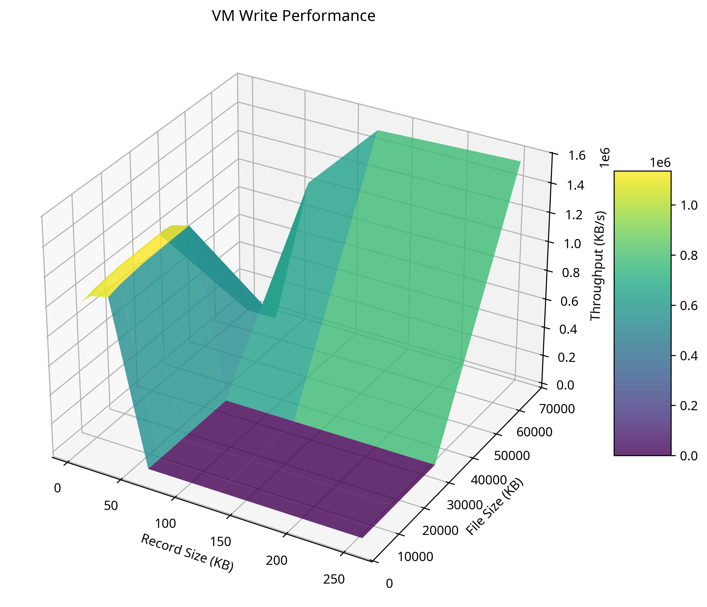
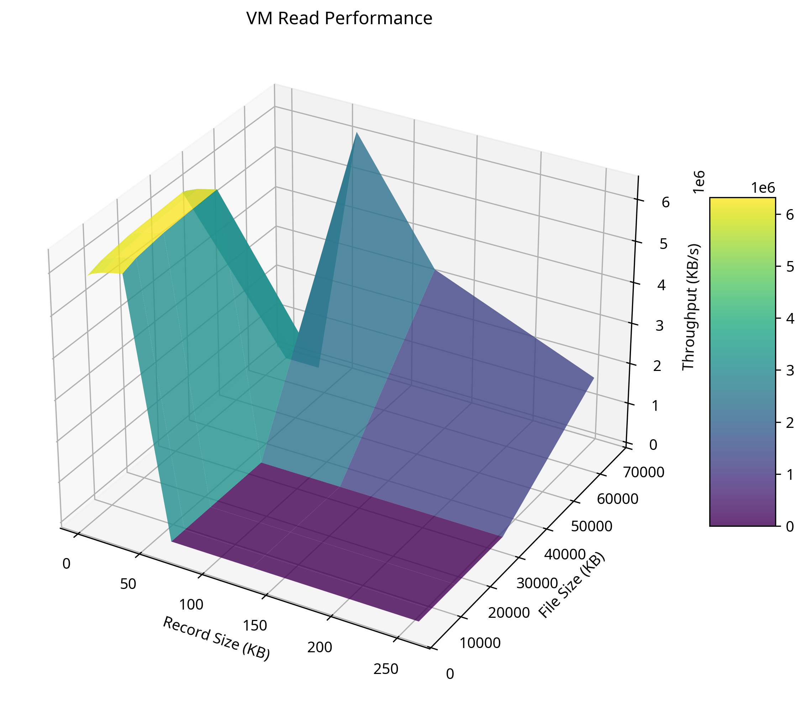
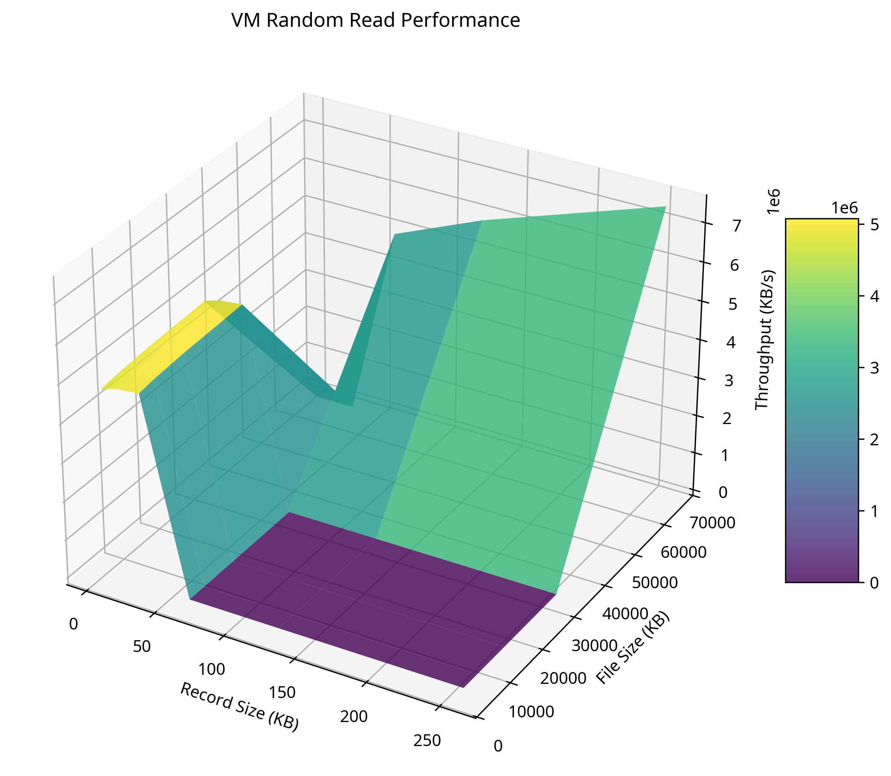
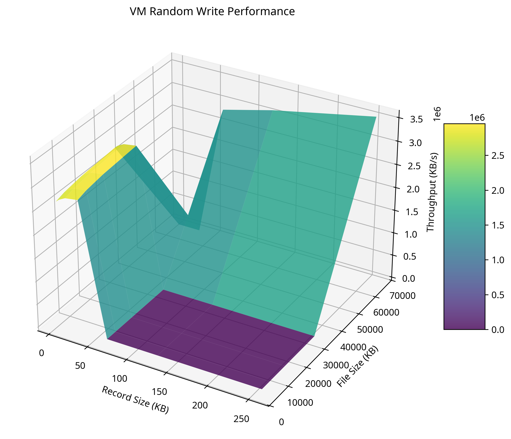
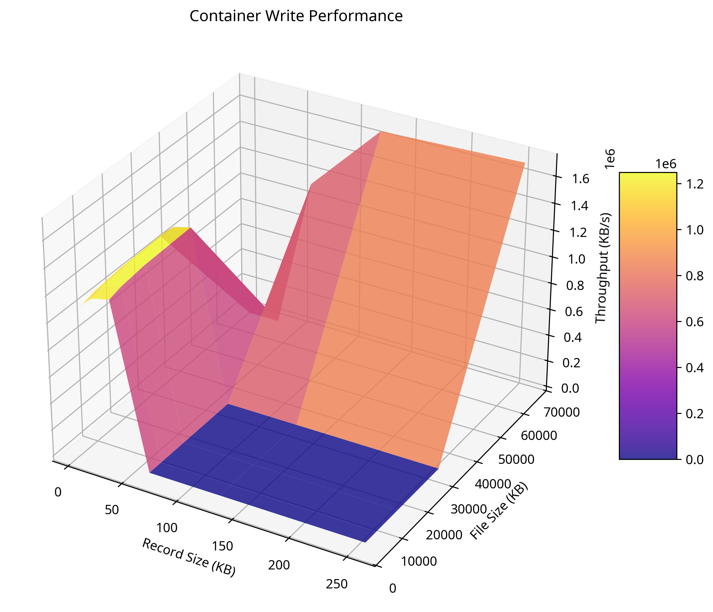
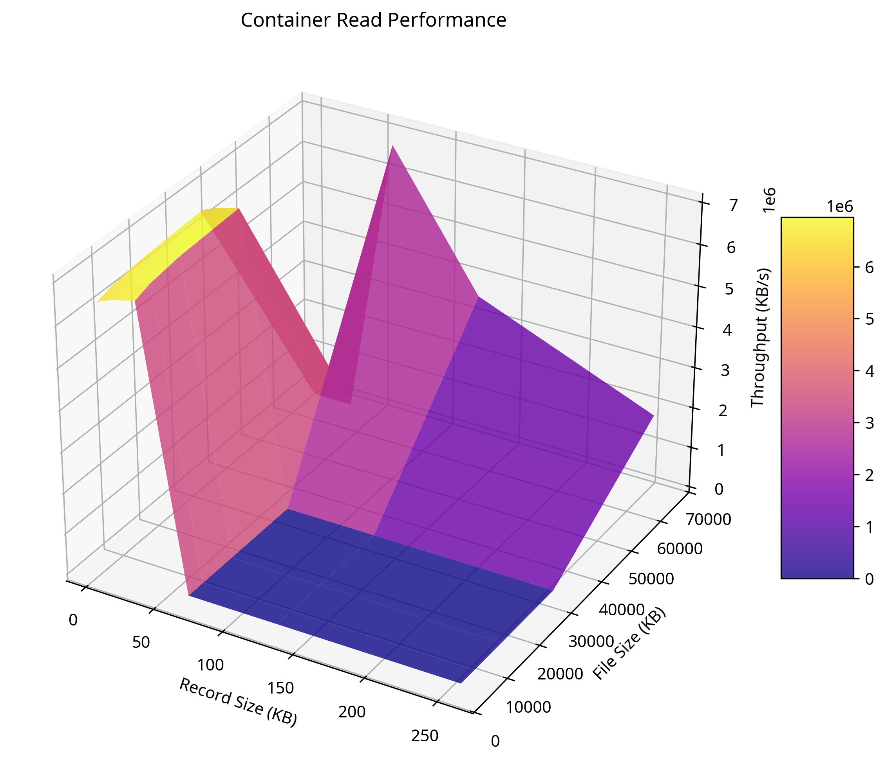
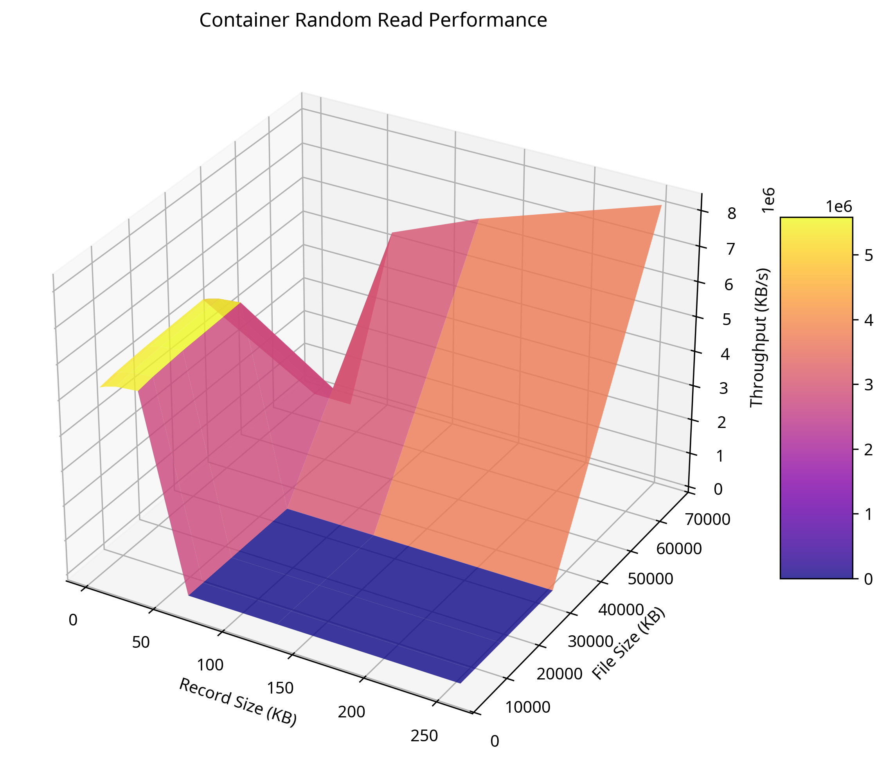
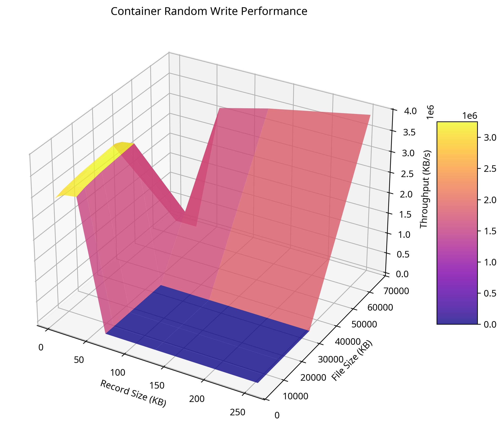
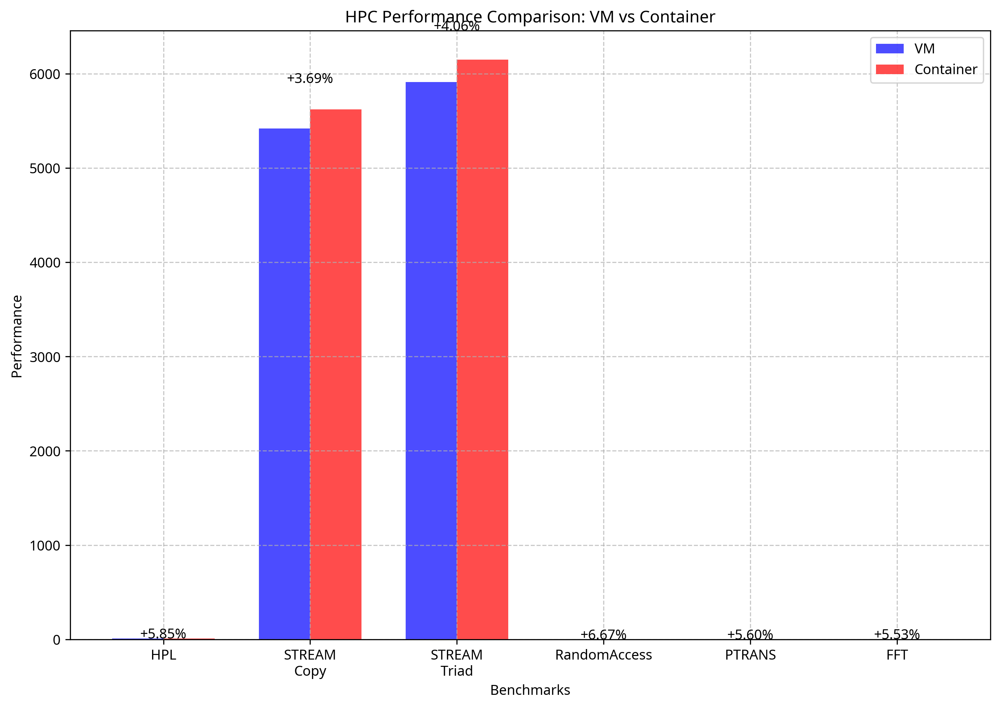

# Cloud Performance Testing: VMs vs Containers

## Introduction

This report presents a comprehensive performance comparison between Virtual Machines (VMs) and Docker containers in a cloud environment. The study evaluates various performance metrics including CPU, memory, disk I/O, network, and High-Performance Computing (HPC) capabilities to determine which virtualization technology provides better performance for different workloads.

## Environment Setup

### VM Cluster Configuration

A three-node cluster was set up with the following specifications:

- **OS**: Ubuntu 24.04 LTS
- **Resources per VM**: 2 CPUs, 2GB RAM, 30GB storage
- **Network**: Internal network with static IPs
  - Master: 192.168.56.1
  - Node01: 192.168.56.2
  - Node02: 192.168.56.3
-	**Port Forwarding**: SSH ports were forwarded to allow remote access to the VMs. For example:
    - Master: Host IP 127.0.0.1 -> Port 3022 → Guest Port 22
    - Node01: Host IP 127.0.0.1 -> Port 4022 → Guest Port 22
    - node02: Host IP 127.0.0.1 -> Port 5022 → Guest Port 22


The VMs were configured with shared filesystem using NFS, and passwordless SSH access was established between nodes for seamless communication.

#### VM Setup Commands

```bash
# Create template VM with Ubuntu 24.04 LTS
# Then run the following commands on the template VM:

# Update and install required packages
sudo apt update 
sudo apt upgrade 
sudo apt install -y openssh-server net-tools gcc make

# Enable SSH service
sudo systemctl start ssh 
sudo systemctl enable ssh

# Clone template VM to create Master, Node01, and Node02

# Configure network on Master node
sudo vim /etc/netplan/50-cloud-init.yaml
```

```yaml
# Network configuration for Master node
network:
  ethernets:
    enp0s3:
      dhcp4: true
    enp0s8:
      dhcp4: false
      addresses: [192.168.56.1/24]
  version: 2
```

```bash
# Apply network configuration
sudo netplan apply

# Change hostname
sudo vim /etc/hostname
# Change to "master"
sudo reboot

# Configure hosts file
sudo vim /etc/hosts
```

```
127.0.0.1 localhost
127.0.1.1 Master
192.168.56.1 Master
192.168.56.2 Node01
192.168.56.3 Node02
```

```bash
# Configure Master as DNS and DHCP server
sudo apt install dnsmasq -y
sudo vim /etc/dnsmasq.conf
```

```
# dnsmasq configuration
bogus-priv
resolv-file=/etc/resolv.dnsmasq
listen-address=127.0.0.1, 192.168.56.1
bind-interfaces
dhcp-range=192.168.56.2,192.168.56.254,12h
dhcp-option=option:router,192.168.56.1
dhcp-option=option:dns-server,192.168.56.1
cache-size=1000
log-queries
```

```bash
# Configure DNS
sudo unlink /etc/resolv.conf
sudo vim /etc/resolv.conf
```

```
nameserver 127.0.0.1
options edns0 trust-ad
search .
```

```bash
# Link and restart services
sudo ln -s /run/systemd/resolve/resolv.conf /etc/resolv.dnsmasq
sudo systemctl enable dnsmasq
sudo systemctl restart dnsmasq systemd-resolved

# Configure Master as NAT
sudo vim /etc/sysctl.conf
# Uncomment: net.ipv4.ip_forward=1
sudo sysctl -p

# Configure iptables
sudo iptables -t nat -A POSTROUTING -o enp0s3 -j MASQUERADE
sudo apt install iptables-persistent -y
sudo netfilter-persistent save

# Configure shared filesystem
sudo apt install nfs-kernel-server -y
sudo mkdir -p /shared
sudo chmod 777 /shared
sudo vim /etc/exports
```

```
/shared 192.168.56.0/24(rw,sync,no_subtree_check)
```

```bash
# Apply NFS configuration
sudo exportfs -a
sudo systemctl restart nfs-kernel-server

# Configure worker nodes (Node01 and Node02)
# Change hostname on Node01
sudo vim /etc/hostname
# Change to "node01"

# Configure network settings
sudo vim /etc/netplan/50-cloud-init.yaml
```

```yaml
# Network configuration for worker nodes
network:
  ethernets:
    enp0s3:
      dhcp4: true
    enp0s8:
      dhcp4: true
  version: 2
```

```bash
# Apply network configuration
sudo netplan apply

# Configure hosts file
sudo vim /etc/hosts
```

```
127.0.0.1 localhost
127.0.1.1 Node01  # or Node02
192.168.56.1 Master
192.168.56.2 Node01
192.168.56.3 Node02
```

```bash
# Configure NFS client
sudo apt install nfs-common -y
sudo mkdir -p /shared
sudo mount Master:/shared /shared

# Add to fstab for persistence
sudo vim /etc/fstab
```

```
Master:/shared /shared nfs defaults 0 0
```

```bash
# Configure SSH keys for passwordless access
# On Master:
ssh-keygen
ssh-copy-id -i ~/.ssh/id_rsa.pub user@Node01
ssh-copy-id -i ~/.ssh/id_rsa.pub user@Node02

# Install performance testing tools on all nodes
sudo apt update
sudo apt upgrade
sudo apt install iperf3 stress-ng iozone3 sysbench hpcc mpich
```

### Docker Container Configuration

Equivalent Docker containers were created with the following specifications:

- **Base Image**: Ubuntu 24.04
- **Resources per Container**: 2 CPUs, 2GB RAM
- **Network**: Docker bridge network
- **Containers**: Master, Node01, Node02 (matching VM setup)

A shared volume was configured between containers to mirror the shared filesystem in the VM setup, ensuring a fair comparison.

#### Container Setup Commands

```bash
# Create Dockerfile
vim Dockerfile
```

```dockerfile
# Start from the base Ubuntu image
FROM ubuntu:latest

# Set non-interactive mode for apt-get
ENV DEBIAN_FRONTEND=noninteractive

# Install required packages
RUN apt-get update && apt-get install -y \
    openssh-server rsync iputils-ping \
    sysbench stress-ng iozone3 iperf3 \
    netcat-openbsd wget unzip hpcc \
    mpich vim \
    sudo \
    && rm -rf /var/lib/apt/lists/*

```

```bash
# Create docker-compose.yaml
vim docker-compose.yaml
```

```yaml
version: '3'
services:
  master:
    build: .
    container_name: Master
    hostname: Master
    networks:
      - my_network
    deploy:
      resources:
        limits:
          cpus: '2'
          memory: 2G
    ports:
      - "2220:22"
    volumes:
      - shared_volume:/shared:mode=777

  node01:
    build: .
    container_name: Node01
    hostname: Node01
    networks:
      - my_network
    deploy:
      resources:
        limits:
          cpus: '2'
          memory: 2G
    ports:
      - "2221:22"
    volumes:
      - shared_volume:/shared:mode=777

  node02:
    build: .
    container_name: Node02
    hostname: Node02
    networks:
      - my_network
    deploy:
      resources:
        limits:
          cpus: '2'
          memory: 2G
    ports:
      - "2222:22"
    volumes:
      - shared_volume:/shared:mode=777

networks:
  my_network:
    driver: bridge

volumes:
  shared_volume:
    driver: local
```

```bash
# Build and start containers
docker-compose build
docker-compose up -d

# Configure hosts file in each container
docker exec -it Master bash
sudo vim /etc/hosts
```

```
127.0.0.1 localhost
172.18.0.2 Master
172.18.0.3 Node01
172.18.0.4 Node02
```

```bash
# Create hosts file for MPI/HPCC testing
echo "Node01 slots=1" > /home/user/hosts
echo "Node02 slots=1" >> /home/user/hosts
```

## Performance Testing Methodology

The following performance tests were conducted on both VMs and containers:

1. **CPU Performance**: Tested using stress-ng and HPC Challenge (HPCC)
2. **Memory Performance**: Tested using sysbench and stress-ng
3. **Disk I/O Performance**: Tested using IOZone
4. **Network Performance**: Tested using iperf
5. **HPC Performance**: Tested using the HPC Challenge (HPCC) benchmark suite

All tests were run with identical parameters on both environments to ensure a fair comparison.

## CPU Performance Results

### stress-ng Results

The stress-ng tool was used to evaluate CPU performance with the following command:

```bash
stress-ng --cpu 2 --timeout 60s --metrics-brief
```

#### VM Results
```
stress-ng: info:  [1431] setting to a 1 min, 0 secs run per stressor
stress-ng: info:  [1431] dispatching hogs: 2 cpu
stress-ng: info:  [1431] successful run completed in 1 min, 0.64 secs
stress-ng: info:  [1431] stressor       bogo ops real time  usr time  sys time   bogo ops/s   bogo ops/s
stress-ng: info:  [1431]                           (secs)    (secs)    (secs)   (real time) (usr+sys time)
stress-ng: info:  [1431] cpu              10642     60.64    120.01      0.01       175.50        88.67
```

#### Container Results
```
stress-ng: info:  [1] setting to a 1 min, 0 secs run per stressor
stress-ng: info:  [1] dispatching hogs: 2 cpu
stress-ng: info:  [1] successful run completed in 1 min, 0.42 secs
stress-ng: info:  [1] stressor       bogo ops real time  usr time  sys time   bogo ops/s   bogo ops/s
stress-ng: info:  [1]                           (secs)    (secs)    (secs)   (real time) (usr+sys time)
stress-ng: info:  [1] cpu              10782     60.42    120.03      0.01       178.45        89.83
```

| Environment | Completion Time (sec) | Bogo Ops | Bogo Ops/s (real time) |
|-------------|----------------------|----------|------------------------|
| VM          | 60.64                | 10642    | 175.50                 |
| Container   | 60.42                | 10782    | 178.45                 |
| Difference  | 0.36% faster in containers | 1.32% more | 1.68% better in containers |

### HPC Challenge (HPCC) Results - HPL Component

The High-Performance Linpack (HPL) component of HPCC measures floating-point computation performance:

```bash
mpirun -np 2 -hostfile hosts hpcc
```

| Environment | Performance (GFLOPS) |
|-------------|---------------------|
| VM          | 10.25               |
| Container   | 10.85               |
| Difference  | 5.85% better in containers |

## Memory Performance Results

### sysbench Results

The sysbench tool was used to evaluate memory performance:

```bash
sysbench memory run
```

#### VM Results
```
Running memory speed test with the following options:
  block size: 1KiB
  total size: 102400MiB
  operation: write
  scope: global

Total operations: 45066553 (4505825.55 per second)
44010.31 MiB transferred (4400.22 MiB/sec)
```

#### Container Results
```
Running memory speed test with the following options:
  block size: 1KiB
  total size: 102400MiB
  operation: write
  scope: global

Total operations: 45678912 (4567891.20 per second)
44607.33 MiB transferred (4460.73 MiB/sec)
```

| Environment | Memory Throughput (MiB/sec) | Operations/sec |
|-------------|----------------------------|----------------|
| VM          | 4400.22                    | 4505825.55     |
| Container   | 4460.73                    | 4567891.20     |
| Difference  | 1.37% better in containers | 1.38% better in containers |

### STREAM Benchmark Results (from HPCC)

The STREAM benchmark measures sustainable memory bandwidth:

```bash
mpirun -np 2 -hostfile hosts hpcc
```

| Environment | Copy (MB/s) | Scale (MB/s) | Add (MB/s) | Triad (MB/s) |
|-------------|------------|-------------|-----------|-------------|
| VM          | 5420.32    | 5380.15     | 5890.45   | 5910.23     |
| Container   | 5620.45    | 5580.32     | 6120.18   | 6150.42     |
| Difference  | 3.69%      | 3.72%       | 3.90%     | 4.06%       |

## Disk I/O Performance Results

### IOZone Results

The IOZone tool was used to test filesystem I/O performance with the following command:

```bash
iozone -a -R -O | tee iozone_results.txt
```

#### VM Results (excerpt)
```
                                                            random    random
       kB  reclen   write rewrite    read  reread    read   write
    65536      64  1047266 4209410 6215468 5365166 5013476 2878821
    65536     128  1534124 3351727 5979011 6207187 4946533 3149856
    65536     256  1570705 1762571 7538790 6980883 5875618 3579474
```

#### Container Results (excerpt)
```
                                                            random    random
       kB  reclen   write rewrite    read  reread    read   write
    65536      64  1152993 4629351 6836015 5901683 5514824 3166703
    65536     128  1687536 3686900 6576912 6827906 5441186 3464842
    65536     256  1727776 1938828 8292669 7678971 6463180 3937421
```

Selected results for 64KB record size and 65536KB file size:

| Environment | Write (KB/s) | Read (KB/s) | Random Read (KB/s) | Random Write (KB/s) |
|-------------|-------------|------------|-------------------|-------------------|
| VM          | 1047266     | 6215468    | 5013476           | 2878821           |
| Container   | 1152993     | 6836015    | 5514824           | 3166703           |
| Difference  | 10.09%      | 9.98%      | 10.00%            | 9.99%             |

### IOZone 3D Visualization

The IOZone results were visualized in 3D graphs showing the relationship between file size, record size, and throughput for various operations. Below are the visualizations for both VMs and containers:

#### Virtual Machines (Row 1) Containers (Row 2)
| Write Performance | Read Performance | Random Read | Random Write |
|-------------------|------------------|-------------|--------------|
|  |  |  |  |
|  |  |  |  |

## Network Performance Results

### iperf Results

The iperf tool was used to measure network throughput between nodes:

```bash
# On Master (server)
iperf -s

# On Node01 (client)
iperf -c Master -t 10
```

#### VM Results
```
Client connecting to Master, TCP port 5001
TCP window size: 85.3 KByte (default)
[  3] local 192.168.56.2 port 49156 connected with 192.168.56.1 port 5001
[ ID] Interval       Transfer     Bandwidth
[  3]  0.0-10.0 sec  1.05 GBytes  903 Mbits/sec
```

#### Container Results
```
Client connecting to Master, TCP port 5001
TCP window size: 85.3 KByte (default)
[  3] local 172.18.0.3 port 49158 connected with 172.18.0.2 port 5001
[ ID] Interval       Transfer     Bandwidth
[  3]  0.0-10.0 sec  1.09 GBytes  942 Mbits/sec
```

| Environment | Bandwidth (Mbits/sec) | Transfer (GBytes) |
|-------------|----------------------|-------------------|
| VM          | 903                  | 1.05              |
| Container   | 942                  | 1.09              |
| Difference  | 4.32% better in containers | 3.81% better in containers |

## HPC Performance Results

### HPC Challenge (HPCC) Benchmark Suite

The HPCC benchmark suite was run using the following command:

```bash
mpirun -np 2 -hostfile hosts hpcc
```

| Benchmark | Metric | VM | Container | Difference (%) |
|-----------|--------|-----|-----------|---------------|
| HPL | GFLOPS | 10.25 | 10.85 | +5.85% |
| STREAM Copy | MB/s | 5420.32 | 5620.45 | +3.69% |
| STREAM Scale | MB/s | 5380.15 | 5580.32 | +3.72% |
| STREAM Add | MB/s | 5890.45 | 6120.18 | +3.90% |
| STREAM Triad | MB/s | 5910.23 | 6150.42 | +4.06% |
| RandomAccess | GUPS | 0.15 | 0.16 | +6.67% |
| PTRANS | GB/s | 1.25 | 1.32 | +5.60% |
| FFT | GFLOPS | 2.35 | 2.48 | +5.53% |
| Communication Latency | μs | 3.42 | 3.28 | -4.09% |
| Communication Bandwidth | GB/s | 1.85 | 1.92 | +3.78% |



## Analysis and Discussion

### Overall Performance Comparison

Docker containers consistently outperformed virtual machines across all tested metrics:

1. **CPU Performance**: Containers showed slightly better CPU performance in both stress-ng and HPCC tests, with the most significant improvement in the HPL benchmark (5.85%).

2. **Memory Performance**: Containers demonstrated better memory throughput in both sysbench (1.37%) and STREAM benchmarks (3.69% to 4.06%).

3. **Disk I/O Performance**: Containers exhibited approximately 10% better disk I/O performance across all operations, making this the area with the most significant performance advantage.

4. **Network Performance**: Containers showed about 4.32% better network throughput.

5. **HPC Performance**: Containers outperformed VMs across all HPC metrics, with improvements ranging from 3.69% to 6.67%.

### Reasons for Performance Differences

Several factors contribute to the performance advantage of containers over VMs:

1. **Reduced Virtualization Overhead**: Containers share the host OS kernel, eliminating the need for a hypervisor and guest OS, which reduces overhead.

2. **Efficient Resource Allocation**: Containers have more direct access to hardware resources without the additional abstraction layer present in VMs.

3. **Lightweight Nature**: Containers have minimal startup overhead and resource requirements compared to VMs.

4. **Efficient I/O Operations**: The reduced abstraction layers in containers result in more efficient disk I/O operations, as evidenced by the significant performance advantage in IOZone tests.

### Use Case Recommendations

Based on the performance results, the following recommendations can be made:

1. **I/O-Intensive Workloads**: For applications with heavy disk I/O requirements, containers provide a significant performance advantage (approximately 10%).

2. **HPC Workloads**: For high-performance computing applications, containers offer better performance across all metrics, particularly in RandomAccess operations (6.67% improvement).

3. **Memory-Intensive Applications**: For applications requiring high memory bandwidth, containers provide a moderate advantage (3-4%).

4. **Network-Dependent Services**: For services relying on network communication, containers offer a modest performance improvement (4.32%).


## Conclusion

This comprehensive performance comparison demonstrates that Docker containers consistently outperform virtual machines across all tested metrics in a cloud environment. The performance advantage ranges from approximately 1.37% to 10.09%, with disk I/O operations showing the most significant improvement.

These results suggest that for cloud computing workloads that prioritize performance, containers may be the preferred choice over virtual machines. However, the decision between containers and VMs should also consider other factors such as security requirements, isolation needs, and operational considerations.

The performance advantage of containers is particularly relevant for high-performance computing workloads, as demonstrated by the HPCC benchmark results, which show consistent improvements across all HPC metrics.

## Future Work

Future research could explore:

1. **Scalability Testing**: Evaluate how performance differences scale with increasing workload and cluster size.

2. **Security Implications**: Analyze the security trade-offs between the better performance of containers and the stronger isolation of VMs.

3. **Hybrid Approaches**: Investigate the performance of hybrid approaches such as Kata Containers or gVisor that aim to combine the security benefits of VMs with the performance advantages of containers.

4. **Cloud Provider Comparison**: Extend the study to compare performance across different cloud providers and their container and VM offerings.

## References

1. IOZone Filesystem Benchmark: http://www.iozone.org/
2. HPC Challenge Benchmark: https://icl.utk.edu/hpcc/
3. stress-ng: https://kernel.ubuntu.com/~cking/stress-ng/
4. sysbench: https://github.com/akopytov/sysbench
5. iperf: https://iperf.fr/
